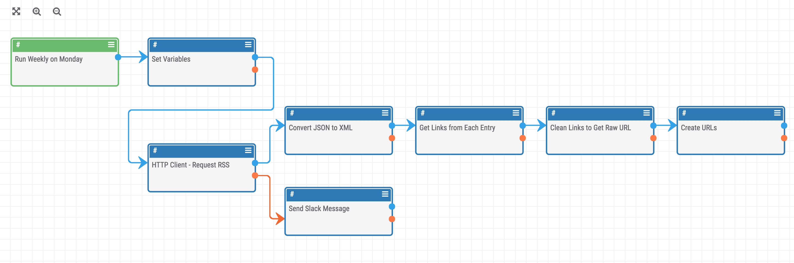

# Google Alerts RSS Reader Playbook

ThreatConnect playbook to read a Google Alerts RSS feed and create indicators from the links.

## Background

Once in a while, there is a Google search that turns up a lot of malicious or compromised domains. When this happens, it is helpful to use [Google Alerts](https://www.google.com/alerts) to get email alerts about the progress of the infection. One of the lesser-known features of Google Alerts, however, is that you can create an RSS feed of the alerts instead of getting email notifications (there are details and instructions on this here: [https://thenextweb.com/google/2013/09/11/google-alerts-regains-rss-delivery-option-it-lost-after-google-readers-demise/](https://thenextweb.com/google/2013/09/11/google-alerts-regains-rss-delivery-option-it-lost-after-google-readers-demise/)).

## Purpose

This playbook is designed to pull the content from an RSS feed of Google alerts, find the URLs from the alerts, and create those URLs as indicators in ThreatConnect.
